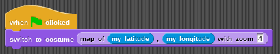
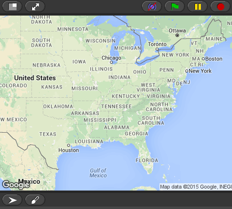

# NetsBlox

NetsBlox is a visual programming language which allows people to develop networked programs.

## Overview
Netsblox is an extension of _Snap!_ which allows users to use some distributed computing concepts and develop network-enabled apps. That is, users can create apps that can interact with other instances of Netsblox. An introduction to the new networking capabilities can be found [here](https://github.com/NetsBlox/NetsBlox/wiki/Introduction-to-Distributed-Programming-in-NetsBlox)

Currently, we have support for _messages_ where a message is like a Snap! event except contains an additional data payload. For example, in the Tic-Tac-Toe example, the user is able to  create a "TicTacToe" message which contains *row* and *column* fields corresponding to the row and column that of the user's move.

Along with the events and messages, we also currently support _remote procedure calls_. RPCs are implemented as REST endpoints on the server which can perform some of the more challenging computation for the student (allowing support to make more complicated apps) as well as providing access to extra utilities not otherwise available to the student.

For example, you can import the `Map utilities` service which gives the user access to Google Maps with a `map of (latitude), (longitude) with zoom (zoom)` block:



This results in the stage costume changing:



## Installation
The recommended method of installation is using [Docker Compose](https://docs.docker.com/compose) as explained below. Otherwise, native installation instructions are also available.
### Docker Compose
First, download the [docker-compose.yml](./docker-compose.yml) file and the [config file for NetsBlox cloud](https://github.com/NetsBlox/cloud/blob/main/crates/cloud/config/default.toml) (or just clone this repository). Next, you may want to update the cloud config (at least to define an initial admin account). Then start all the services by running the following from the same directory as the docker-compose.yml file:
```
docker-compose up
```

To enable more NetsBlox services (like `GoogleMaps`), define the required environment variables (ie, the API keys) under the `environment` section of the "NetsBlox RPCs" section of the docker-compose file.

Next, just navigate to `localhost:8080` in a web browser to try it out!

#### Development with Docker
Setup and start MongoDB as described in the last step.

Pull in and create a container running the base image for NetsBlox
` docker run -it -p 8080:8080 -e MONGO_URI='mongodb://172.17.0.1:27017/netsblox' -v my/netsblox/dir/path:/netsblox --name nb-base netsblox/base /bin/bash`

Helpful commands:
- start stop the container: `docker start nb-base` `docker stop nb-base`
- attach to the container to run commands: `docker attach nb-base` and detach by sending EOL: Ctrl+d

Finally attach to the instance and follow native installation. You can run the server in dev mode using `ENV=dev npm run dev`

Access and edit the source files at the address you specified in the beginning `my/netsblox/dir/path`

### Native
Before installing, NetsBlox requires [nodejs](https://nodejs.org/en/) (>= 8) and a [MongoDB](https://www.mongodb.com/download-center?jmp=nav#community) database. By default, NetsBlox will expect MongoDB to be running locally (this can be changed by setting the `MONGO_URI` environment variable).

Server protocol can also be set through `SERVER_PROTOCOL` environment variable.
Host should be set using `HOST=.mydomain.com`.

First clone the repository and install the dependencies.
```
git clone https://github.com/NetsBlox/NetsBlox.git --recursive
cd NetsBlox
npm install
```
Finally, start the server with `npm start` and navigate to `localhost:8080` in a web browser to try it out!

## RPC Support
RPCs that are using 3rd party API's often require getting an API key from the given 3rd party API. After obtaining a key, the appropriate environment variable should be set to given key value:

### Required Environment Variables for RPCs
- Maps
  - `GOOGLE_MAPS_KEY` should be set to an API key from the [Google Static Maps](https://developers.google.com/maps/documentation/static-maps/)
- Air Quality
  - `AIR_NOW_KEY` should be set to an API key from [AirNow](https://airnow.gov/)
- Weather
  - `OPEN_WEATHER_MAP_KEY` should be set to an API key from [OpenWeatherMap](http://openweathermap.org/api)
- NASA
  - `NASA_KEY` should be set to an API key from [NASA](https://api.nasa.gov/)
- Traffic
  - `BING_TRAFFIC_KEY` should be set to an API key from [Bing Traffic](https://msdn.microsoft.com/en-us/library/hh441725.aspx)
- Twitter
  - `TWITTER_BEARER_TOKEN` should be set to an API key from Twitter
- [Pixabay](https://pixabay.com)
  - `PIXABAY` should be set to an API key from Pixabay

To simplify this process (and to keep your `~/.bashrc` clean), these values can be stored in a `.env` file in the project root directory and they will be loaded into the environment on starting NetsBlox.

## Examples
After opening the browser, click the `file` button in the top left and click on `Examples` to check out some example networked apps!
