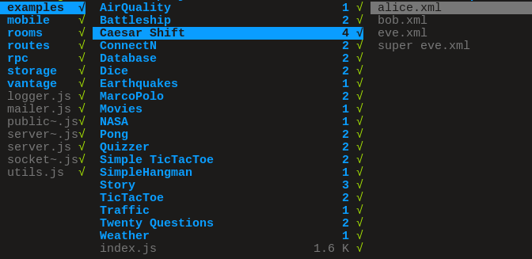

Adding Example Projects
=======================

This page outlines the current method of adding example projects to NetsBlox.
This method will be changing in favor of a simpler approach.

This is particularly useful after creating a custom RPC (see :doc:`hello-custom-services`), as it is useful to create a project showcasing how the RPC can be used (assuming you have created a Custom RPC and have also created an example project using the given RPC).

Example projects are currently stored in ``src/server/examples/<room name>/``.
Each role is added as its own xml file named after the given role name.
An example is shown below:

Adding the Example
------------------

After creating the project, shift-click on the project icon:

.. image:: project-menu.png
    :alt: Project menu dropdown in the NetsBlox editor
    :align: center

Then select ``Export role...``.
It should download the code for the given role.
If your project has multiple roles, you will need to do this for each role.
Then you need to create a directory with the name of the desired example name and place these exported role xml files in the given directory.
They should be named after the desired name of the given roles.
