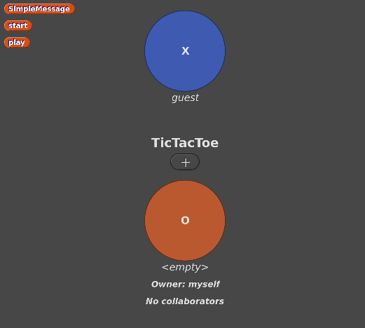

Concepts
========

Rooms
-----

The NetsBlox Room defines the local network for a given application.
A room can contain a number of different roles which are distinct NetsBlox clients running in their own window or machine.
For example, a TicTacToe game may consist of two roles, X and Y, which represent the two players in the game of TicTacToe:

Messages
--------

Remote messaging allows users to send messages over the internet between different instances of NetsBlox, enabling users to create distributed, online apps.
Unlike events, messages can contain a structured data payload. That is, they can be used to send information between NetsBlox scripts and users.
The structure of messages is defined in a message type.
A message type contains the name of the message as well as the names of the expected fields of the message.
For example, a message type may specify a type of message called ``TicTacToe`` that contains fields for ``role``, ``row``, and ``column``.

Services (RPCs)
---------------

Services are provided by the NetsBlox server and allow the client to easily incorporate third party utilities (such as :doc:`/services/GoogleMaps/index`, :doc:`/services/MovieDB/index`, :doc:`/services/Weather/index`, and Traffic data) as well as simplifies the creation of games which otherwise may be more complex (such as Battleship and ConnectN).
