Walkthroughs
============

Signing up/in
-------------

In order to save your projects to the cloud or play multiplayer games, you need to have a NetsBlox account.

Open the `editor <https://editor.netsblox.org>`_ and click on the cloud icon, there you will find the signup button.
When you are filling the form make sure to use an up to date and working email address.
After you sign up a password will be emailed to you.
Go to your email copy the password and come back to the editor.
You can then change this password via the ``change password`` option in the same cloud menu.

*Note: If you can't find the email from NetsBlox, make sure to check your email's spam folder.*

Sending and receiving messages
------------------------------

Message sending and receiving can be done using the following blocks:

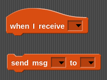

The top block, ``when I receive``, is used to receive messages from other users and the bottom block, ``send msg``, can be used to send messages to other users.

Receiving messages
^^^^^^^^^^^^^^^^^^

The message handling block contains a dropdown for setting the message type for which it listens:

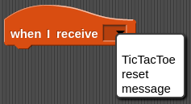

This dropdown contains the names of all defined message types in the given role.
Selecting one of the message types will dynamically change the block and add variable blocks for each of the expected fields in the given message type:

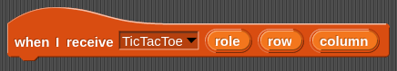

Upon receiving a message, these variable blocks will be set to the values received in the given message.
In the above example, this allows the user to retrieve the values sent for ``role``, ``row``, and ``column``.

Sending messages
^^^^^^^^^^^^^^^^

Like the ``when I receive`` block, the ``send msg`` block also contains a field for specifying the message type:

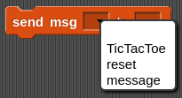

After setting the message type, the send block will update to provide inputs for each of the expected inputs:

The empty input fields contain grayed out text displaying the field name for the corresponding input.
These inputs can be filled just as any other block input slot:

Finally, the block only needs to specify to whom we want to send the given message.
This is specified using the last dropdown:

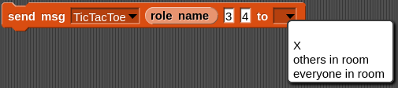

This dropdown contains all the roles in the room as well as two extra fields: ``others in room`` and ``everyone in room``.
Setting the field to ``others in room`` will result in the given role broadcasting the message to all other roles in the room whereas ``everyone in room`` will send the message to everyone in the room including the sender.
Selecting any other entry will result in the message being sent only to the corresponding role.

After selecting the role, the message can be sent!
In the following example, the block will send a ``TicTacToe`` message with the ``role`` field set to the role name of the sender, the ``row`` field set to 3 and the ``column`` field set to 4.
This message will be broadcasted to everyone else in the room (not including the sender).

Using Services (Remote Procedure Calls)
---------------------------------------

Using services is pretty easy.
Simply select the ``Services`` tab from the project menu:

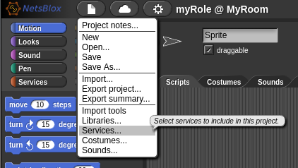

Then select the desired service to import from the dropdown:

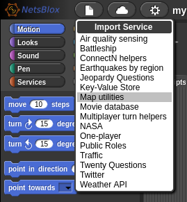

Now, the map RPC blocks are available under the ``Custom`` tab:

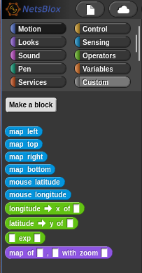

Then you can use the provided blocks to leverage the NetsBlox service:

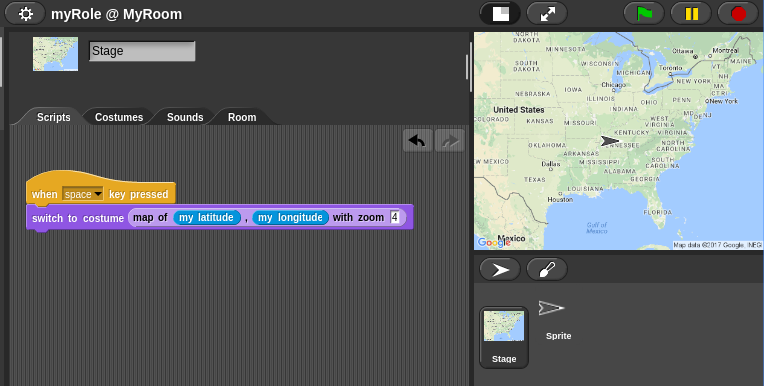

Managing rooms
--------------

The owner of the ``TicTacToe`` game can use the room tab to add new roles to the room (using the ``+`` button), add/remove roles, rename roles and invite other users to occupy different roles in the given room.
This is done by clicking on the given role in the room tab:

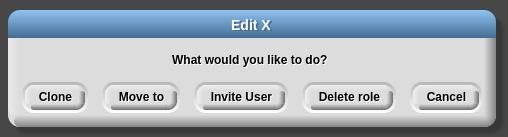

From this dialog, there are a number of supported actions:

- *cloning* the role: This will create a new role in the room which is a copy of the clicked role. This includes sprites, blocks, costumes, code blocks, etc.
- *moving* to the role: This option allows the owner to move from the currently occupied role to the clicked role.
- *inviting* another user: Inviting a user will allow the owner to invite other users to occupy the given role at the room. This allows the given user to run and edit the blocks running at the given role.
- *deleting* the role: This will remove the role and all it's blocks from the given room and project.

However, if a user is already occupying the given role, then the dialog also allows the owner to *evict* the user.
This will remove that user from the owner's project:

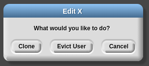

Roles can be renamed by clicking on the name of the role:

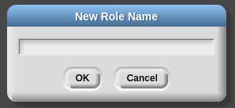

Working with custom messages
----------------------------

A number of the Services include predefined message types to be used with the given service (such as the :doc:`/services/ConnectN/index`, :doc:`/services/Earthquakes/index` and :doc:`/services/Battleship/index` services).
However, there are many cases in which a user may want to define a custom message type.
This can be done by first clicking on the ``Make a message type`` block in the block palette under the ``Services`` tab:

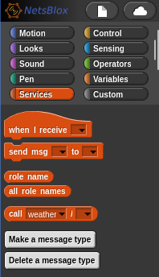

This will open the message type creation dialog.
This dialog provides an interface for specifying the name and fields for the given message type:

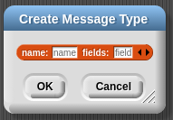

After selecting ``OK``, the given message type will be created!
An example of creating the ``TicTacToe`` message type used throughout this example is shown below:

.. image:: create-message-tictactoe.png
    :alt: How to create the example TicTacToe message type
    :align: center

In this example, the name has been set to ``TicTacToe`` and the fields input has been extended to have three slots (by clicking the right arrow).
These fields have been named ``role``, ``row``, and ``column``.

Playing multiplayer games
-------------------------

#. Sign in: First things first, for multiplayer games to work all the players need to be signed up and logged in. `Signing up/in`_.
#. Find & open a game you like: you can go through the list of our examples and user created apps on `NetsBlox front page <https://netsblox.org/>`_, or have a friend share his own creation with you.
#. Get the participants in the game/room: 

    - If you are the first one opening the game (owner), to invite your opponents/teammates, go to the room tab you will see a circular view of the room and available roles. Each player occupies one role. To invite players click on a role choose invite users and search for your friend's username and hit ok to ask them to join your game.
    - If you are being invited to a game, make sure you have the `editor <https://editor.netsblox.org>`_ open in your browser and that you are signed in. After you are invited, you will get a dialog asking you if you want to join the game.

#. Start the game: make sure all the players are in by looking at the room view, if there is someone missing go back to third step. Now that you are all set, the main role can start the game by clicking on the green flag at the top right corner. You can maximize the stage (playground) by clicking on the icon.

To test multiplayer games, you can invite yourself to play by opening a new browser tab, going to the netsblox editor and invite ``myself`` as a player.

.. raw:: html

    
<iframe width="650" height="350" src="https://www.youtube.com/embed/h5q8M-N25uI" title="YouTube video player" frameborder="0" allow="accelerometer; autoplay; clipboard-write; encrypted-media; gyroscope; picture-in-picture" allowfullscreen></iframe>

