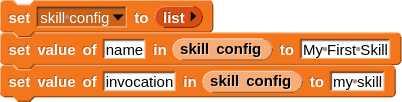
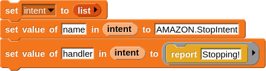
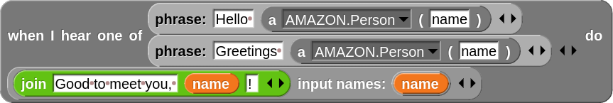

Creating Your First Alexa Skill
===============================

Let's make our first Alexa skill in NetsBlox! At a high level, the service expects the user to provide a configuration for an Alexa service (as a table) and then will create the skill from this configuration. The skill will be automatically available on your phone or any Alexa device that uses the same Amazon account (though it may need to be enabled, first!). In this walkthrough, we will create a simple Alexa skill and test it within NetsBlox!

Before using any Alexa RPCs, you will first need to `register as a developer with Amazon <https://developer.amazon.com/settings/console/registration?return_to=/settings/console/mycid>`_ and login to Amazon `here </services/routes/alexa/login.html>`_.

Creating the Configuration
##########################
First, we will import the "Structured Data" library from the official NetsBlox libraries (select "Libraries" from the file dropdown).

Next, we will create a new variable, "skill config", for our skill configuration. For this walkthrough, we will set the name to "My First Skill" and invoke it using "my skill":

|

|

After setting some of the basic parameters for our skill, we can now create our first intent for it. To start, we will just define a handler for an existing intent type provided by Amazon called "AMAZON.StopIntent". For a complete list of built-in intent types, check out the Alexa documentation `here <https://developer.amazon.com/en-US/docs/alexa/custom-skills/standard-built-in-intents.html>`_.

|

|

This stop intent is called whenever the skill is told to stop. When this happens, the function provided as the "handler" will be called and the reported text will be spoken to the user. In this case, when our skill is told to stop, Alexa will simply say "Stopping!".

We can also define custom intents though these will need to define a list of acceptable utterances and potentially some slots as well. An example intent for greeting the user is given below:

|

|

This intent responds to utterances like "Hello (name)" and "Greetings (name)". The curly braces ("{" and "}") denote that the given spot is a slot, a placeholder for a given named value. In this case, the slot is named "person". The slots field contains a list of the slots used in this intent. In this case, there is only a single slot: the person slot. The type for this slot is set to AMAZON.Person to designate that it is expecting a name. When the intent is invoked, the spoken name (stored in the "person" slot) will be passed to the handler as the "name" variable. The handler will then tell Alexa to say "Good to meet you, (name)!".

Next, we simply need to set the intents of our skill configuration to these two new skills:

|

|

And finally we can create the skill using the `createSkill` RPC! We will store the returned ID in a variable so we can use it with some of the other RPCs (such as one for testing it).

|

.. image:: create_skill.png
    :alt: Creating our skill using the createSkill RPC
    :align: center

|

Before creating more skills, feel free to check out the `best practices for defining utterances <https://developer.amazon.com/en-US/docs/alexa/custom-skills/best-practices-for-sample-utterances-and-custom-slot-type-values.html#sample-utterance-phrasing>`_.

Testing the Skill in NetsBlox
#############################
Testing Alexa skills in NetsBlox is pretty straightforward using the `invokeSkill` RPC:

|

|

Note: if you see an error shortly after creating the skill such as ("Requested skill model cannot be found"), it may still be building your skill. It should be available shortly (~30 seconds or so).

Testing the Skill in the Alexa App
##################################
Skills can also be tested in the Alexa App or on other Alexa devices like the Echo. In either case, the skill needs to be enabled for the given account from the mobile app and then should be available on all devices using the given account. The general process should be something like this:

1. Open the Amazon Alexa mobile app
2. Navigate to the skills view. On Android, you can select "More" (in the lower right) and then "Skills & Games".
3. Select the category "Your Skills" and then the "Dev" category
4. Your newly created skills should show up in a list. Select the skill you would like to enable.
5. Select "Enable to Use". It will likely prompt you to link your NetsBlox account. Login and grant permissions to the skill from NetsBlox (following the on-screen directions).
6. Start using your skill! It might be good to start with a command like "tell (invocation name) to (intent utterance)".

If there are any issues or problems, feel free to report them on `GitHub <https://github.com/NetsBlox/NetsBlox/issues>`_!
