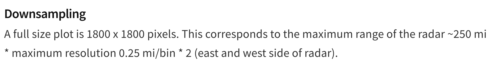
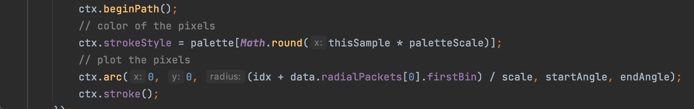

# Nexrad Radar Services

Nexrad Radar Services plots REF images on a google static map.

## Structure

    nexrad-radar
        |—— nexrad-radar.js                         // source code
        |—— draft.js                                // a draft for development
        |—— RadarLocations.js                       // latlng of all radars
        |—— README.md
        |—— libraries
            |—— nexrad-level-2-data               
            |—— nexrad-level-2-plot

## Questions

    1. What functions should be public to the users? Right now Nexrad Radar Services support setting up the map, listing
       radars, plotting some radars, and plotting all radars. What are some other functionalities that should be added?

    2. The services have to be run in a specific order: setMap --> listRadars --> plotRadars / plotAllRadars. Is this a
       good practice? If so, what is a good way to alert the user when he/she runs the functions in the wrong order?

    3. I haven't implemented caching functionalities. Is the ability to cache the plot necessary? 

    4. I downgraded jimp to an older version so that some functionalities can work. Is this OK?

## Process of Projection

To paste a nexrad plot onto a static google map, we follow these steps:

    1. get the bounding box in LatLng given the LatLng of the center of the nexrad radar
        1) the central LatLng of the nexrad radar can be acquired from /utils/constants.js
        2) the bounding box is always 920km x 920km, the source is from nexrad-level-2-plot:

    2. transform the bounding box from LatLng to XY
        1) we use the helper functions in netsblox.js to accomplish this
    
    3. for each pixel xy within the bounding box, transform it back to LatLng, get the corresponding pixel on nexrad plot from Latlng, paste the color of that pixel onto xy
        1) nexrad plot is just plain 2D, because nexrad-level-2-plot does not perform any additional processing when it draws the plot

           "ctx.strokeStyle = palette[Math.round(thisSample * paletteScale)];" sets the color of the arc

           "ctx.arc(0, 0, (idx + data.radialPackets[0].firstBin) / scale, startAngle, endAngle);" draws the arc the radius 
            is just idx, as data.radialPackets[0].firstBin is almost always 0 and scale is 1 for a 1800x1800 plot, which is the standard condition

           moreover, I am not seeing the official documentation for nexrad data does not talk about projection anywhere, 
            which further convinces me that nexrad plot is just a plain 2D image of its products

        2) since nexrad plot does not involve distortion, and it covers the range of 460km(radius), we can get the distance 
            in km that a pixel represents; we can easily locate a specific pixel on nexrad plot given LatLng

## How the Downloader Works

The mechanism of current downloader:

    1. use aws-sdk to download data from AWS
    
    2. a "day" defined in the bucket is from 6pm yesterday to 6pm today, thus, every time we download up-to-date date, 
       we check whether there is a "tommorrow"
    
    3. if there is, download data using the key of "tomorrow"
    
    4. otherwise, download data using the key of "today"

           
      
    

    